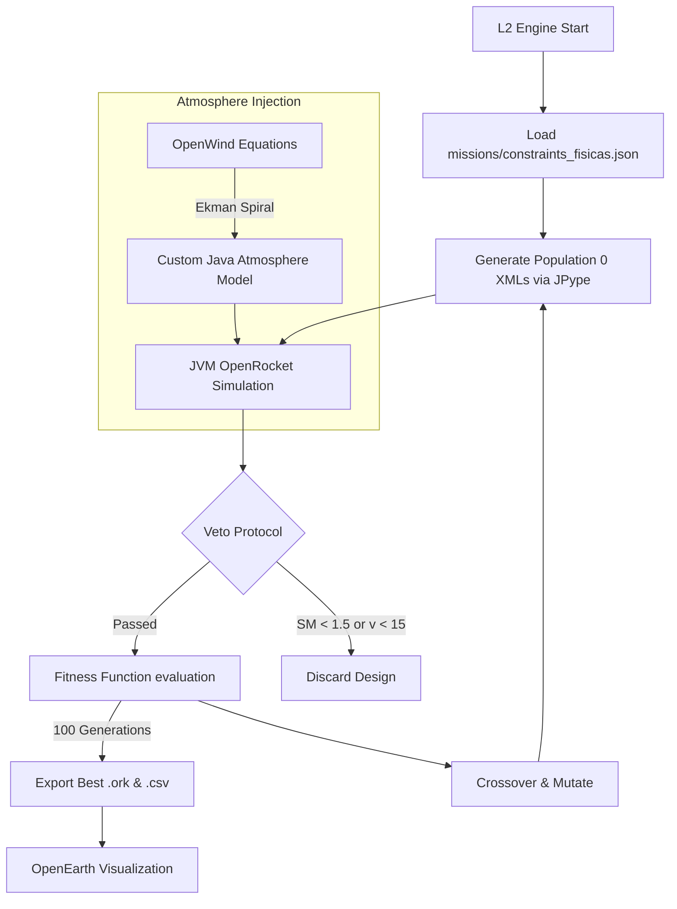

# Arquitetura de Integração L2-OSIFOG

O motor de otimização interage com o OpenRocket de forma 100% *headless*. 

## 1. Execução via `orhelper` (JPype Bridge)
Em vez de usar `subprocess` e rodar a CLI do `.jar` por fora e fazer parse de CSVs pesados, nós usamos o `orhelper` para criar uma *ponte* direto com a Máquina Virtual Java (JVM) do OpenRocket dentro da memória do Python.

## 2. Injeção Atmosférica (OpenWind & OpenEarth)
O OpenWind usa a Espiral de Ekman e leis de potência baseadas na rugosidade do terreno.
**A Estratégia de Integração:**
1. A IA interceptará o perfil de vento fornecido pelo OpenWind (ou suas equações).
2. Substituiremos o `AtmosphericModel` padrão do OpenRocket na memória da JVM por um modelo customizado injetado via JPype.
3. O modelo customizado retornará vetores de vento $(Wx, Wy, Wz)$ em função da altitude $(Z)$ e do tempo $(t)$ calculados pelas fórmulas de Ekman.
4. O *weathercocking* será calculado organicamente pelo simulador Java com os ventos injetados pelo Python.
5. Os dados de trajetória 3D gerados na simulação serão exportados estruturados para o OpenEarth poder plotá-los.

## 3. Árvore de Execução

