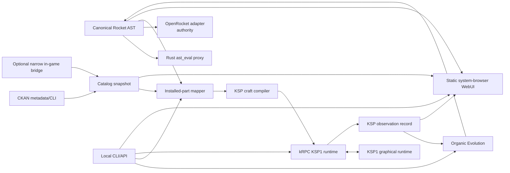

# L2-OSIFOG KSP Integration — Architecture and Implementation Plan

**Status:** proposed
**Research date:** 2026-07-26
**Primary delivery target:** KSP 1.12.5, stock first, then CKAN-managed mods

## Executive summary

L2-OSIFOG should integrate with Kerbal Space Program through a narrow adapter
boundary, not by teaching the Rust simulator about KSP internals. The existing
canonical path remains:

`rocket AST -> Rust ast_eval proxy -> OpenRocket authority`

KSP adds a sibling product path:

`rocket AST -> installed-part mapping -> KSP craft -> KSP runtime observation`

OpenRocket remains the authority for real-rocket validation. KSP is a runtime,
visualization, and game-physics target with its own explicitly named telemetry
and calibration records. A KSP result must never overwrite or masquerade as an
OpenRocket authority result.

The recommended first integration is KSP1 because the essential mechanisms are
verified:

- kRPC can launch a named craft from the active save's `Ships/VAB` or
  `Ships/SPH` directory.
- kRPC exposes live vessel state, flight data, control, staging, resources, and
  server-side streams.
- CKAN supplies machine-readable mod identity, version compatibility,
  dependencies, conflicts, install layout, and KSP1 instance awareness.
- KSP1 craft and part state use KSP's ConfigNode-shaped text representation,
  but exact round-trip behavior, attachment transforms, variants, and
  mod-specific persistent fields must be proven against an installed game
  before calling the compiler supported.

“Live loading” must be split into three different claims:

1. **Generate and launch a new craft without manual VAB work — verified for
   KSP1 via kRPC.**
2. **Refresh or load a generated craft into an open editor — technical spike.**
3. **Replace an already flying craft in place — unsupported and excluded from
   the product path because it risks save and runtime corruption.**

KSP itself is not a verified headless simulator. KSP1 can be driven from an
external local process while the graphical game is running; that is
automation-friendly, not headless. The Rust proxy remains the actual headless,
high-throughput evaluator.

## Decision record

| ID | Decision | Rationale |
|---|---|---|
| KD-01 | Preserve the current AST and `ast_eval` JSON/JSONL contract as the engine boundary. | It already supports batch proxy evaluation, capability discovery, persistent serving, structured failures, and deterministic candidate identity. |
| KD-02 | Implement one fixed, versioned KSP1 adapter rather than a generic plugin framework. | KSP1 is the only game target; abstractions beyond its proven contracts would add cost without a second use case. |
| KD-03 | Deliver KSP1 stock before CKAN-managed modded KSP1. | Stock proves craft topology and runtime control before ModuleManager, part switches, and ecosystem variation multiply the state space. |
| KD-04 | Use kRPC for KSP1 launch, control, and telemetry; add a tiny L2 bridge only for capabilities kRPC cannot supply. | kRPC already provides the expensive RPC and stream surface. Duplicating it would add maintenance and safety risk. |
| KD-05 | Treat CKAN as package/provenance metadata, not as the physical part catalog. | CKAN knows modules, versions, dependencies, conflicts, and install rules; it does not resolve final per-part physics after ModuleManager and runtime code. |
| KD-06 | Make an in-game resolved catalog snapshot authoritative for modded KSP1. | Raw `.cfg` parsing cannot reliably reproduce ModuleManager patches or runtime `PartModule` changes. |
| KD-07 | Never silently approximate an unmappable AST node. | Mapping failure is structured search feedback. Geometry must evolve or the adapter must gain explicit support, consistent with the no-manual-polishing doctrine. |
| KD-08 | Use a system browser and static WebUI; do not ship Electron or move physics into JavaScript. | Keeps runtime and dependency cost bounded while preserving an interactive renderer. |
| KD-09 | Store installation paths, catalogs, downloads, builds, telemetry, generated craft, and credentials outside Git. | Required by the product boundary and prevents redistribution of game/mod assets. |
| KD-10 | Require explicit arming for any runtime control. | Reading telemetry and writing throttle/staging controls cross different safety boundaries. |

## Evidence and claim discipline

### Status legend

- **Verified:** directly documented by a primary project source or already
  implemented in this repository.
- **Inferred:** strongly supported by available interfaces, but not yet run in
  this workspace against the target game installation.
- **Spike:** requires an executable experiment before it can enter a supported
  capability matrix.
- **Excluded:** deliberately not promised.

### Current L2-OSIFOG capabilities

| Capability | Status | Evidence |
|---|---|---|
| Dynamic rocket topology | Verified | `rocket_ast.py` defines serializable AST nodes and mutation/compilation behavior. |
| Fast local evaluation | Verified | `l2_engine/src/bin/ast_eval.rs` supports one-shot JSON, persistent JSONL, and `--capabilities`; `docs/engine/ast-eval-contract.md` documents the protocol. |
| Physics/proxy separation | Verified | `organic_loop.py` batches candidates through Rust while `rocket_ast.py` and the OpenRocket path compile and validate elites. |
| OpenRocket authority | Locked | `.agents/skills/l2-organic-evolution/SKILL.md` and `docs/project_doctrine.md`. |
| Real motor identity discipline | Verified | Motor designation is consistent across AST, `.eng`, and OpenRocket; see `.agents/skills/l2-organic-evolution/references/contracts.md`. |
| Failure memory/calibration | Verified | The organic loop records structured failures and proxy/authority divergence without making the proxy authoritative. |
| Generic runtime adapter API | Not present | This is desirable only as a small data contract, not a framework. |

The codebase knowledge graph confirms the main entry points are
`organic_loop.main`, `l2_engine.src.bin.ast_eval.main`, and the OpenRocket
mission/validation commands. The graph also shows that `run_rust_evaluator`
already accepts candidates, objectives, constraints, execution profile, and
divergence data. KSP integration should consume its results; it should not
alter the evaluator's core protocol merely to mirror KSP concepts.

### External capability matrix

| Target | Craft generation/load | Live telemetry/control | Mod discovery | Physical catalog | Product status |
|---|---|---|---|---|---|
| KSP1 stock | **Verified mechanism**, compiler is a spike: write save-local `.craft`, then kRPC `LaunchVessel` | **Verified:** kRPC vessel/control/flight/stream APIs | N/A | **Spike:** snapshot installed stock parts and attachment nodes | Primary |
| KSP1 modded | **Spike:** persistent module fields and variants vary by mod | **Verified core**, mod-specific fields are best-effort until declared | **Verified:** CKAN metadata and CLI/instance model | **Spike:** resolved `PartLoader`/ModuleManager snapshot | Planned after stock |

## Requirements

### Functional requirements

| ID | Priority | Requirement | Acceptance boundary |
|---|---|---|---|
| KSP-FR-01 | Must | Detect explicitly configured KSP installations and report edition, version, root, save paths, and adapter capabilities. | Read-only; no recursive discovery outside approved roots. |
| KSP-FR-02 | Must | Snapshot a KSP1 stock part catalog with stable part name, title, provider, mass, cost, attachment nodes, dimensions, resources, engine data, staging role, and variants when available. | Snapshot is versioned and content-addressed; unknown fields remain explicit. |
| KSP-FR-03 | Must | Map an L2 AST to a graph of installed KSP parts without modifying the canonical AST. | Sidecar mapping includes one reason per unmapped node or invalid attachment. |
| KSP-FR-04 | Must | Produce a deterministic KSP1 `.craft` and a machine-readable build report. | Same AST + catalog digest + mapping policy yields byte-identical output. |
| KSP-FR-05 | Must | Load/launch a generated KSP1 craft through the game without manual VAB construction. | kRPC launch succeeds or returns a structured preflight failure. |
| KSP-FR-06 | Must | Stream timestamped KSP1 telemetry for position, velocity, attitude, mass, resources, thrust, Mach, dynamic pressure, acceleration, staging, and terminal events where exposed. | Unsupported fields are null with capability reasons, never fabricated. |
| KSP-FR-07 | Must | Support opt-in throttle, attitude/autopilot, and staging commands with arm/disarm and watchdog behavior. | Disarmed or disconnected sessions cannot continue commanding the craft. |
| KSP-FR-08 | Must | Persist KSP observation runs separately from Rust and OpenRocket results. | Every record names adapter, game version, install fingerprint, craft digest, catalog digest, mod set, and control profile. |
| KSP-FR-09 | Must | Discover CKAN-managed modules, versions, compatibility, dependencies, conflicts, and provenance for an approved instance. | Manual/unmanaged content is flagged rather than guessed as a CKAN module. |
| KSP-FR-10 | Must | Build a modded KSP1 catalog from the *resolved in-game database*, with CKAN metadata joined as provenance. | ModuleManager/runtime resolution is reflected; raw config is never labelled authoritative. |
| KSP-FR-11 | Should | Feed repeated KSP observations into a KSP-specific ranking/divergence model. | It affects KSP target ranking only and cannot weaken OpenRocket gates. |
| KSP-FR-12 | Should | Expose generation, mapping reports, craft builds, runs, telemetry, and rendering through a localhost API. | API wraps the same application services as the CLI. |
| KSP-FR-13 | Should | Render the canonical rocket graph in a browser with stage inspection and color/material presentation controls. | Rendering uses derived geometry by default; local game assets never enter Git or network responses without an explicit local-only policy. |
| KSP-FR-14 | Should | Support installed stock and modded KSP1 parts without hardcoded three-stage or fixed-part templates. | Part selection is catalog-driven and evolves/searches within declared constraints. |
| KSP-FR-15 | Spike | Determine whether an open KSP1 editor can safely refresh/load a newly generated craft. | Promote only after repeatable load/save/reload tests with no save mutation or stale references. |

### Non-functional requirements

| ID | Target |
|---|---|
| KSP-NFR-01 Determinism | Identical inputs create identical mapping reports and craft bytes; runtime nondeterminism is recorded with game seed/time and run metadata when obtainable. |
| KSP-NFR-02 Local-first | No cloud service, hosted database, or browser-side simulation dependency. |
| KSP-NFR-03 Isolation | A KSP adapter crash, game exit, or malformed craft cannot terminate an organic population run or corrupt OpenRocket state. |
| KSP-NFR-04 Safety | Local network listeners bind to loopback by default; write targets are allow-listed and atomic; actuation requires explicit arming. |
| KSP-NFR-05 Performance | CLI capability reporting <1 s excluding game startup; local daemon <80 MB idle; API p99 <100 ms for cached metadata; telemetry UI remains responsive at 10 Hz. |
| KSP-NFR-06 Dependency discipline | No generic plugin framework, ORM, Electron shell, or message broker. Every added dependency gets a direct/transitive audit and removal plan. |
| KSP-NFR-07 Compatibility honesty | Every artifact includes edition, exact game version, adapter version, mod-set digest, and capability flags. |
| KSP-NFR-08 Repository hygiene | Generated craft, parsed catalogs, asset caches, downloads, builds, telemetry, install paths, and tokens remain outside version control. |
| KSP-NFR-09 Licensing | Do not redistribute Squad/Intercept/Take-Two assets or mod assets without a compatible license; catalog facts and locally derived preview geometry remain separated from source assets. |
| KSP-NFR-10 Regression protection | Existing AST, Rust proxy, OpenRocket authority, and OSIFOG fixture tests remain green without KSP installed. |

## Recommended architecture



### Layer responsibilities

#### 1. Canonical design layer

Retain the existing `ASTNode {type, params}` sequence and mission contracts.
Add stable per-node IDs only if the existing deterministic identity is
insufficient for mapping provenance. Do not add KSP part names, Unity
transforms, CKAN identifiers, or craft persistence fields to the core AST.

The mapping sidecar is the correct location for platform-specific state:

```json
{
  "schema": "l2.ksp.mapping/v1",
  "ast_digest": "sha256:...",
  "catalog_digest": "sha256:...",
  "target": {"edition": "ksp1", "version": "1.12.5"},
  "bindings": [
    {
      "ast_node_id": "stage-0/body-0",
      "part_name": "fuelTank.long",
      "provider": "Squad",
      "attach": {"parent_node": "top", "child_node": "bottom"},
      "symmetry": null,
      "variant": null,
      "confidence": "exact"
    }
  ],
  "unmapped": []
}
```

#### 2. Catalog layer

Use three explicit fidelity tiers:

1. **Package inventory:** CKAN module metadata and manually detected install
   folders. This answers “what is installed and compatible?”
2. **Static candidate catalog:** parsed raw part configs and asset metadata.
   This is useful before launching KSP but is not authoritative in modded
   installs.
3. **Resolved runtime catalog:** a snapshot after KSP, ModuleManager, and
   `PartLoader` have built the final available-part database. This answers
   “what part does the game actually instantiate?”

Each `PartRecord` needs:

- `part_name` (the stable config/internal name, never only the localized title);
- provider/module identity and source-relative path;
- game version and CKAN module/version when attributable;
- dry/wet mass inputs, cost, category, crew capacity;
- stack/radial attachment nodes and transforms;
- bounds or conservative envelope dimensions;
- resource capacities;
- engine thrust/Isp/propellants and gimbal where resolved;
- decoupler, separator, docking, command, control, fin/lift, parachute, fairing,
  and procedural/part-switch module facts;
- variants and persistent selection fields;
- provenance and `resolved|static|unknown` confidence per field.

The cache key is the installation fingerprint, not just KSP version:

`edition + game version + CKAN registry/mod-set digest + manual content digest + bridge schema`

#### 3. Mapping layer

AST-to-craft mapping is a constrained graph search:

- satisfy node role and mission constraints;
- preserve stage order and parent/child topology;
- select compatible attachment nodes and diameters;
- respect part availability, symmetry, engine/mount roles, fuel/resource
  compatibility, staging, mass, and declared mod policies;
- rank feasible alternatives; return all hard failures as structured reasons.

Do not “repair” a design by silently stretching a stock tank, substituting an
unrelated engine, or deleting an AST node. A mapper failure becomes evolutionary
pressure. If a desired topology requires procedural parts or a specific mod,
the mission declares that catalog capability.

#### 4. KSP1 craft compiler

The compiler is deterministic and pure:

`AST + Mapping + CatalogSnapshot + CraftPolicy -> craft bytes + BuildReport`

Before supporting a field, prove it through a round trip:

1. create the smallest equivalent craft in KSP1;
2. save and inspect it;
3. generate the same structure;
4. load it in KSP;
5. save it again;
6. compare semantic ConfigNode trees;
7. relaunch and verify staging/part state.

Coverage expands by fixtures: one serial stack, radial symmetry, decoupling,
multi-stage, liquid engine/tank, solid motor, fins/control surfaces, parachute,
fairing, variants, then selected mod modules.

#### 5. KSP1 runtime adapter

Use kRPC as an external dependency, not vendored game code. The adapter owns:

- connection and capability negotiation;
- game scene transition when needed;
- discovery of launchable craft;
- `LaunchVessel` invocation and preflight errors;
- server streams sampled into a normalized telemetry envelope;
- explicit arm/disarm and bounded control commands;
- event detection and run finalization;
- disconnect recovery.

Runtime state machine:

`DISCONNECTED -> CONNECTED_READ_ONLY -> ARMED -> LAUNCHING -> FLYING -> TERMINAL -> DISARMED`

Any connection loss, stale heartbeat, scene mismatch, active-vessel change, NaN,
or command deadline violation transitions to `DISARMED`. Commands carry session
ID and monotonically increasing sequence numbers. A stage command is
single-use and cannot be replayed.

The supported “live load” operation writes a unique craft name into the
approved save and asks kRPC to launch it. Editor refresh/load remains a separate
spike. Active-flight replacement is excluded.

#### 6. KSP observation and optimization

KSP observation is sequential and expensive:

1. generate/evaluate a population with Rust;
2. map and compile a diverse shortlist;
3. launch one craft at a time in KSP;
4. execute a versioned control profile;
5. record normalized telemetry and terminal outcome;
6. update a KSP-specific CKG/divergence record keyed by install fingerprint;
7. mutate or select the next generation.

The system may learn that a KSP part graph/control profile fails, but it must
not globally penalize generic `STAGE` or `BODY_TUBE` grammar nodes. This mirrors
the existing authority-context discipline.

KSP telemetry is named `ksp_observation`; OpenRocket remains
`openrocket_authority`. Cross-engine comparison reports show both and never
collapse them into one score without an explicit mission-specific objective.

#### 7. Local API and WebUI

The CLI ships first. The API wraps the same application services and stores no
physics logic. Recommended endpoints:

- `GET /v1/capabilities`
- `GET /v1/installations`
- `POST /v1/catalogs/snapshot`
- `GET /v1/catalogs/{digest}/parts`
- `POST /v1/mappings`
- `POST /v1/crafts`
- `POST /v1/runs`
- `GET /v1/runs/{id}`
- `GET /v1/runs/{id}/events` (SSE)
- `POST /v1/runs/{id}/arm`
- `POST /v1/runs/{id}/commands`
- `GET /v1/designs/{digest}/scene`

Use a static, framework-free browser client and a pinned, audited 3D rendering
library only if a raw-WebGL proof is measurably less maintainable. No embedded
browser is needed. The browser renders a `RocketScene` made of tubes, cones,
fins, attachment transforms, stages, and optional locally licensed meshes.
Presentation colors/materials live in a render sidecar. Applying a visual
choice to a KSP craft is enabled only when the selected part exposes a verified
stock variant or supported recolor module.

The default UI never serves original game textures/models. Local asset previews
require an explicit policy and remain on loopback.

## Compatibility boundaries

### KSP1 stock

Initial support target: exact KSP 1.12.5 installation plus kRPC 0.6.x.
“Stock” means Squad parts and installed official expansions are fingerprinted
separately. A craft that needs an expansion cannot be called base-stock
compatible.

Supported after Phase 2:

- serial and radial rocket stacks covered by fixtures;
- generated save-local craft;
- launch through kRPC;
- streamed flight observation;
- guarded control/staging;
- canonical primitive rendering.

Not implied:

- headless Unity execution;
- editor hot reload;
- all aircraft/robotics/cargo/DLC modules;
- exact reproduction of OpenRocket or real-world physics.

### KSP1 modded

Each supported profile is a tuple:

`KSP version + CKAN mod-set lock + manual-mod digest + catalog digest + adapter version`

Stock craft compatibility does not imply Realism Overhaul, RealFuels,
procedural parts, FAR, TweakScale, B9PartSwitch, or recolor compatibility.
Those mods change physical and persistence contracts. Support is capability-
based and fixture-backed, not inferred from a folder name.

CKAN actions are read-only by default. Installing, removing, or upgrading mods
requires an explicit user command, a displayed transaction plan, and CKAN's own
resolver. L2-OSIFOG must not directly copy files into `GameData`.

## Phased implementation

### Phase 0 — Contract and installation reconnaissance

**Deliverables**

- Versioned neutral schemas: `InstallationDescriptor`, `CatalogSnapshot`,
  `PartRecord`, `MappingReport`, `CraftBuildReport`, `RuntimeCapability`,
  `TelemetryEnvelope`, `RunRecord`.
- `ksp capabilities --installation <id>` read-only CLI.
- OS-specific external state directory policy:
  `%LOCALAPPDATA%/L2-OSIFOG` on Windows and XDG equivalents elsewhere.
- Test fixture boundaries that do not require shipping game assets.
- Baseline measurements and dependency audit.

**Verification gates**

- Existing Rust/Python/OpenRocket tests run with no KSP installed.
- Capability discovery never writes into a game or save directory.
- No KSP path or username is committed to fixtures.
- Architecture budget recorded: CLI startup, idle memory, dependency count,
  and output schema size.

### Phase 1 — KSP1 stock catalog and craft round trip

**Deliverables**

- Read-only KSP1 installation/save detector.
- Stock `PartRecord` snapshot path.
- Semantic ConfigNode parser/writer scoped to craft fixtures.
- AST-to-part mapping for the first rocket-relevant stock subset.
- Deterministic craft compiler and build report.
- Fixture ladder: single part, two attached parts, staged engine/tank,
  radial fins, decoupler, multi-stage, parachute, variant.

**Verification gates**

- Every fixture loads in KSP1 1.12.5, re-saves, reopens, and preserves semantic
  topology and staging.
- Same input produces byte-identical craft and report.
- Missing part, bad attachment, unsupported module, and incompatible catalog
  fail before writing a craft.
- Writes are atomic and limited to a generated namespace in one approved save.

### Phase 2 — KSP1 launch, telemetry, and guarded control

**Deliverables**

- kRPC 0.6.x connector and capability negotiation.
- `LaunchVessel` workflow for generated craft.
- 10 Hz normalized telemetry stream and append-only run log.
- Runtime state machine, arming, heartbeat, command sequence checks, and
  disconnect disarm.
- Repeatable stock ascent control profile.

**Verification gates**

- Twenty consecutive generate-load-launch smoke runs without manual VAB edits.
- Telemetry includes source timestamps and reports unsupported fields.
- p95 observed sample gap <=250 ms at a requested 10 Hz on the reference host.
- Disconnect, scene change, and active-vessel switch prevent further commands.
- Throttle returns to a documented safe state and no stage command can replay.

### Phase 3 — KSP observation loop

**Deliverables**

- Shortlist promotion from Rust evaluations to KSP runs.
- KSP-specific run scorer and contextual failure signatures.
- Install-fingerprint-specific calibration/divergence store.
- Deterministic control-profile versioning and replay metadata.
- Comparative report: Rust proxy, KSP observation, OpenRocket authority.

**Verification gates**

- Three seeded campaigns reproduce candidate selection and craft bytes.
- KSP nondeterminism is visible as distributions, not hidden by one run.
- KSP feedback changes only KSP-target ranking.
- OpenRocket gates and result labels are unchanged.

### Phase 4 — CKAN-aware modded KSP1

**Deliverables**

- CKAN instance/module reader using stable machine-readable CLI output or CKAN
  metadata files, with exact client version recorded.
- Dependency/conflict/compatibility graph and mod-set lock digest.
- Narrow in-game bridge exporting resolved `PartLoader`/ModuleManager catalog
  facts that static parsing cannot establish.
- Join logic from resolved part -> source provider -> CKAN module/version.
- Adapter profiles for the first explicitly selected mod sets.

**Verification gates**

- A CKAN-managed stock+kRPC instance snapshots reproducibly.
- Every resolved part is assigned `ckan`, `manual`, `official`, or `unknown`
  provenance; none are silently guessed.
- ModuleManager-modified values match the in-game resolved part.
- Removing/upgrading a mod invalidates the catalog fingerprint.
- L2 never directly mutates `GameData`; all package changes go through CKAN
  after explicit confirmation.

### Phase 5 — Local API, rendering, and customization

**Deliverables**

- Loopback API over the CLI application services.
- Static system-browser UI for mission configuration, mapping failures,
  generated geometry, stages, telemetry plots, and run comparison.
- `RocketScene` schema and primitive renderer.
- Render-sidecar color/material choices.
- Verified translation from render choices to stock variants or declared
  recolor mods when supported.

**Verification gates**

- UI contains no simulation or scoring implementation.
- API cached metadata p99 <100 ms on the reference dataset.
- Daemon idle memory <80 MB; dependency and bundle budgets pass.
- Rendering works with no game assets.
- Unauthorized origins and non-loopback connections are rejected by default.

### Phase 6 — KSP1 editor-load spike

**Deliverables**

- Disposable-save experiment comparing:
  file generation + kRPC launch; editor refresh; editor load API/plugin.
- Repeated load/save/reload and scene-transition stress test.
- Decision: supported, requires narrow bridge, or rejected.

**Promotion gate**

Promote editor loading only if 50 repeated loads preserve topology, staging,
variants, and save integrity with no stale Unity object references. Otherwise
retain launch-from-generated-craft as the only “live load” claim.

### Phase 7 — Open-source product hardening

**Deliverables**

- Minimal public CLI documentation and adapter compatibility matrix.
- OSIFOG reduced to a worked mission/fixture, not platform architecture.
- License and provenance audit for code, schemas, examples, screenshots, and
  optional assets.
- Sanitized `.gitignore` and first-run diagnostics.
- Reproducible build/test matrix with KSP-free unit tests and opt-in local game
  integration tests.

**Verification gates**

- Fresh clone runs engine and adapter unit tests without proprietary assets.
- No generated state, local path, game file, mod download, credential, or
  telemetry log is tracked.
- Public examples use synthetic or license-compatible assets/data.

## Testing strategy

### Contract tests

- JSON Schema fixtures for every versioned DTO.
- Round-trip AST and mapping sidecars.
- Golden semantic ConfigNode trees rather than only byte snapshots.
- `ast_eval --capabilities` remains independent of KSP.

### Mapping/property tests

- Parent attachment exists on both parts.
- No cycle or disconnected non-root component.
- Stage order and decoupler reachability are preserved.
- Symmetry group membership is consistent.
- Resources match engine needs under the chosen profile.
- Every AST node is mapped or has an explicit failure.

### Game integration tests

Run only against user-supplied local installs:

- disposable save cloned outside the repository;
- craft load/re-save/reopen;
- launch preflight and terminal-event capture;
- connection loss and disarm;
- repeated scene transitions;
- exact mod-set profile.

Tests must never overwrite a user's primary save or existing craft name.

### Calibration tests

- Repeat the same craft/control profile enough times to expose game variance.
- Record rank correlation between Rust and KSP for promoted candidates.
- Partition calibration by installation fingerprint.
- Invalidate results when game, mods, bridge, catalog, or control profile
  changes.

## Security and failure model

| Boundary | Risk | Mitigation |
|---|---|---|
| User -> local API | Untrusted paths or commands | Loopback bind, schema validation, canonicalize and allow-list roots, no arbitrary command endpoint. |
| L2 -> save directory | Craft/save corruption | Generated namespace, atomic temp+rename, collision refusal, backups for any approved overwrite, disposable integration saves. |
| L2 -> kRPC | Unauthenticated local control or stale commands | Loopback-only server configuration, explicit arm token/session, heartbeat, monotonic sequences, timeout-to-disarm. |
| CKAN metadata/download -> machine | Supply-chain or wrong-version mod | Use CKAN resolver and hashes, show transaction plan, pin instance, no implicit install/update. |
| Modded game -> catalog | Malicious or malformed metadata | Treat strings/files as untrusted, size limits, schema validation, no code execution in parser. |
| Browser -> game controls | Accidental staging/throttle | Read-only UI by default; separate arming gesture and short-lived session; stage confirmation. |
| Game/mod assets -> public project | Copyright/license violation | Never commit or redistribute by default; derived primitive rendering; explicit license allow-list. |
| KSP adapter -> engine | Runtime crash poisons evolution | Subprocess isolation, structured failed observation, bounded retries, campaign continues. |

Failure records use a common taxonomy:

`installation | catalog | mapping | craft_parse | craft_preflight | connection | scene | telemetry | control | runtime | terminal | compatibility`

Every failure includes retriable/non-retriable status and evidence. Automatic
retry is limited to connection/transient scene failures; malformed craft,
mapping, compatibility, and safety failures require a new candidate or adapter
change.

## Risk register

| ID | Risk | Likelihood | Impact | Mitigation / gate |
|---|---|---:|---:|---|
| KR-01 | Generated KSP1 craft syntax loads but has wrong attachment/staging semantics. | High | High | Semantic round-trip fixtures and in-game launch verification before coverage claims. |
| KR-02 | Raw part configs disagree with ModuleManager/runtime parts. | High | High | Resolved in-game snapshot is authoritative for modded catalogs. |
| KR-03 | kRPC or game version drift breaks runtime calls. | Medium | High | Capability negotiation, exact pins, adapter matrix, graceful read-only fallback. |
| KR-04 | KSP nondeterminism misleads optimization. | High | Medium | Repeated observations, distribution reporting, fixed control profile, separate KSP score. |
| KR-05 | “Live load” is interpreted as active-flight replacement. | Medium | High | Product terminology and state machine explicitly exclude in-place replacement. |
| KR-06 | Mod assets or proprietary game files enter the repository. | Medium | High | External state roots, ignore rules, asset license audit, synthetic fixtures. |
| KR-07 | Catalog-driven mapping becomes a second hardcoded rocket builder. | Medium | High | Constraint search over catalog, mapping sidecar, structured failure, organic mutation. |
| KR-08 | WebUI becomes a second simulation implementation. | Medium | Medium | Scene/telemetry DTO only; engine/API remain authoritative; contract tests. |
| KR-09 | Control continues after UI/client disconnect. | Low | Critical | Server-side watchdog, explicit arm lease, command expiry, disconnect disarm tests. |
| KR-10 | CKAN metadata is mistaken for resolved physical data. | Medium | High | Three catalog tiers and provenance/confidence on every field. |
| KR-11 | Dependency stack bloats the local tool. | Medium | Medium | Budgets, dependency audits, system browser, no Electron/ORM/broker/framework. |
| KR-12 | Mod-specific persistent fields corrupt craft or behavior. | High | High | Profile-specific fixtures; unsupported modules fail closed. |
| KR-13 | Game installation updates invalidate cached mappings. | Medium | High | Content-addressed installation/mod/catalog fingerprint and automatic invalidation. |

## Success metrics

### KSP1 stock release gate

- 100% of the declared initial AST node subset maps or emits a documented hard
  failure; no silent node loss.
- 20/20 generated stock smoke craft load and launch through kRPC.
- Byte-identical craft/report for identical inputs.
- 50/50 semantic load-save-reopen tests preserve topology and staging across
  the fixture corpus.
- Requested 10 Hz telemetry has p95 sample gap <=250 ms and <1% missing samples
  during a reference ascent, with gaps explicitly marked.
- 100% of forced disconnect/scene-change tests disarm control.
- Zero regression in existing Rust/organic/OpenRocket tests.

### Modded KSP1 release gate

- Every runtime-resolved part has provenance and per-field confidence.
- CKAN module/version/dependency graph matches the approved instance.
- Catalog digest changes whenever a relevant game/mod/bridge input changes.
- Each advertised mod profile has load-save-reopen and launch fixtures.
- No direct `GameData` mutations by L2-OSIFOG.

### Platform/UI gate

- CLI capability report <1 s excluding external game/CKAN startup.
- Local daemon <80 MB idle and cached API p99 <100 ms.
- UI renders canonical geometry without proprietary assets.
- API, CLI, and WebUI produce the same mapping/build/run identifiers.

## Open questions

1. Which exact KSP1 installation and official expansions will define the first
   stock compatibility profile?
2. Is Windows the sole first-release host, or must Linux/Proton path and process
   handling ship in the same milestone?
3. Should KSP runtime integration begin read-only, or is guarded automated
   ascent control required for the first public release?
4. Which first mod profile matters: a visual/parts pack, FAR, procedural parts,
   or the Realism Overhaul/RealFuels ecosystem? Each implies different mapper
   and persistence work.
5. May the local UI display extracted game/mod meshes, or should the public
   product permanently use derived primitive geometry unless an asset's license
   is explicitly compatible?
6. Is editor hot-load valuable enough to justify a custom KSP1 bridge after
   generated-craft launch already works?
7. What KSP mission objective should drive KSP-specific evolution: altitude,
   orbit insertion, payload fraction, cost, survivability, landing, or a
   multi-objective archive?

## Primary sources

### L2-OSIFOG

- [Project doctrine](../../docs/project_doctrine.md) — locked execution,
  authority, and no-manual-polishing decisions.
- [Organic evolution skill](../../.agents/skills/l2-organic-evolution/SKILL.md)
  — active AST -> Rust -> OpenRocket workflow.
- [AST evaluator contract](../../docs/engine/ast-eval-contract.md) — batch,
  JSONL serve, capabilities, environment, and result behavior.
- [Engine README](../../docs/engine/README.md) — safe engine entry points.
- [Project doctrine](../../docs/project_doctrine.md) — authority and reporting
  discipline.
- [Organic contracts](../../.agents/skills/l2-organic-evolution/references/contracts.md)
  — AST, motor identity, and OpenRocket compilation rules.

### KSP1 and kRPC

- [kRPC project](https://github.com/krpc/krpc) — external script control and
  maintained KSP1 RPC implementation.
- [kRPC `SpaceCenter.LaunchVessel` API](https://krpc.github.io/krpc/csharp/api/space-center/space-center.html)
  — launches a named `.craft` from the current save's craft directory and
  documents preflight behavior.
- [kRPC vessel API](https://krpc.github.io/krpc/latest/lua/api/space-center/vessel.html)
  — live vessel, mass, load/pack state, parts, and control-related data.
- [kRPC stream protocol](https://krpc.github.io/krpc/communication-protocols/messages.html)
  — server-side fixed-update streams and client lifecycle.
- [kRPC 0.6.0 release](https://github.com/krpc/krpc/releases) — current scene,
  staging, telemetry, performance, and control capabilities.

### CKAN and mod ecosystems

- [CKAN project](https://github.com/KSP-CKAN/CKAN) — active KSP mod manager,
  CLI, instance, and compatibility implementation.
- [CKAN metadata specification](https://github.com/KSP-CKAN/CKAN/blob/master/Spec.md)
  — module identity, game versions, dependencies, conflicts, hashes, install
  rules, and KSP1 destinations.
- [CKAN user guide](https://github.com/KSP-CKAN/CKAN/wiki/User-guide) —
  instance and package management behavior.

## Final recommendation

Approve Phases 0-3 as the KSP integration spine. They deliver a real,
testable KSP1 product while preserving the existing engine and OpenRocket
authority. Approve Phase 4 only after the stock compiler and runtime are stable,
because modded catalog resolution is a distinct subsystem. Treat the WebUI as
a later view over proven CLI services.

This sequence is lean, falsifiable, and compatible with organic evolution:
missing mappings become search feedback, runtime observations remain
source-labelled, and no platform adapter gains authority over the engine's
existing real-rocket validation path.
